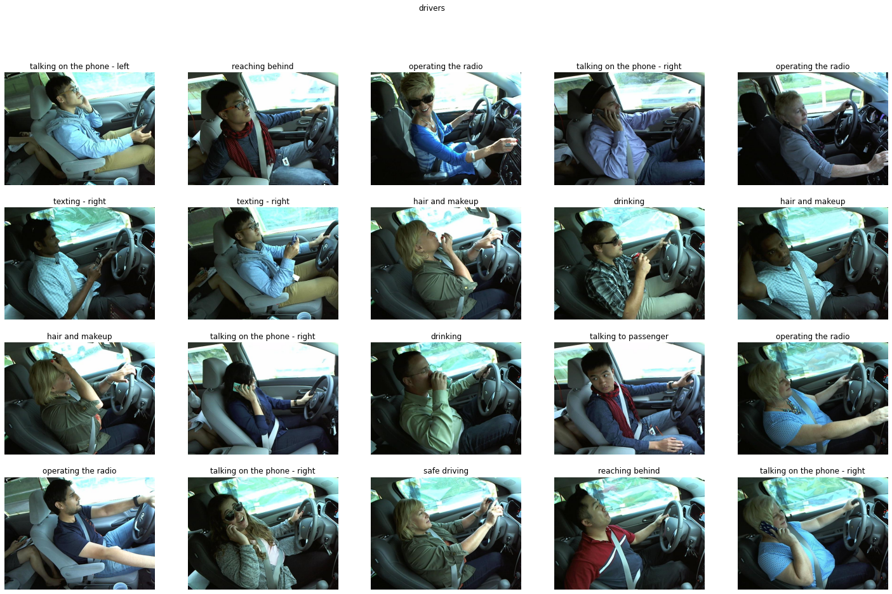

# The challenge

The aim of our project is to propose some solutions to the 2016 kaggle challenge named State Farm Distracted Driver Detection. Given some driver images taken inside their cars we would like to predict what they are doing. As described on kaggle web page, the ten classes of behavior to predict are:

* c0: safe driving
* c1: texting - right
* c2: talking on the phone - right
* c3: texting - left
* c4: talking on the phone - left
* c5: operating the radio
* c6: drinking
* c7: reaching behind
* c8: hair and makeup
* c9: talking to passenger

## The Different approachs and proposed architectures

We are given a dataset of 22 434 images taken by 26 drivers, each of them have several images of each class. We also have a csv dataset describing all those informations.

We chose to solve this challenge mainly with deep learning techniques. In order to avoid over-fitting we chose to apply the data augmentation technique to our pictures. It will improve the performances of our networks.

Therefore, we used, the random transformations we use contain horizontal flips, because images can contain rotations in practice and crop, so we can accentuate on some objects and to remove unwanted details/objects.

Our problem can be seen as an action recognition problem on still images, therefore we tried to apply some basics techniques used for those problems.

We also tried to solve the given problem with the combination of a pretrained convolutional network and a classical machine learning algorithm as described in the article Action Recognition in Still Images using Residual Neural Network Features by Sreela S R, Sumam Mary Idicula. We chose a Resnet18 trained on ImageNet as a encoder. We withdrew the last 2048 fully connected layer. We can therefore extract vectors embedding of 512 units from the input images. We fed those extracted vectors to the input of a machine learning algorithm as a decoder. SVM with rbf kernel performed the best among Random forest and KNN with an accuracy of only 28%. Another technique we used was inspired by the article Deep Ensemble Learning for Human Action Recognition in Still Images proposed by Xiangchun Yu. We implemented a model in three part.The first part this a VGG16 wich is a combination of successive convolutional networks, in the second part we fed the output of this neural network to the inputs of three branches of convolutional neural networks. The third part is classifier of two hidden layer, both with 2048 units and a last output of 10 units.
